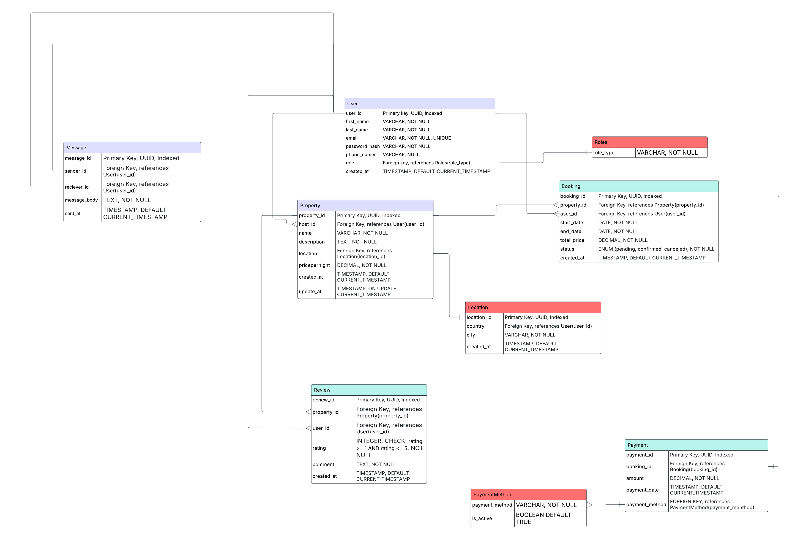

# requirement-analysis

## Introduction
This repository is dedicated to exploring the concept of requirement analysis in software development. 
It covers best practices, methodologies, and tools used to gather, document, and manage software requirements effectively. 
The goal is to provide a structured approach to understanding user needs and translating them into clear specifications for development teams.

## What is Requirement Analysis?
Requirement Analysis is the process of identifying, gathering, and evaluating the needs and expectations of stakeholders for a software project. 
It is a crucial phase in the Software Development Lifecycle (SDLC) that lays the foundation for designing and developing a system that meets user requirements.

During requirement analysis, the development team works closely with stakeholders to understand the business objectives, user needs, and system constraints. 
This information is then documented in the form of functional and non-functional requirements, which serve as a guide for the subsequent phases of development, including design, implementation, and testing.

**Importance in SDLC:**
- **Clarifies Objectives:** Ensures that all stakeholders have a clear understanding of what the software should achieve.
- **Reduces Errors:** Early identification of requirements prevents misunderstandings and reduces costly changes later.
- **Improves Planning:** Helps in estimating time, cost, and resources more accurately.
- **Enhances Communication:** Provides a common understanding among developers, testers, and stakeholders.
- **Ensures Quality:** Establishes measurable criteria for evaluating the success of the software.

In essence, requirement analysis is the bridge between the user’s vision and the technical implementation, ensuring that the final product delivers value and meets expectations.

## Why is Requirement Analysis Important?

Requirement Analysis is a critical step in the Software Development Lifecycle (SDLC) because it ensures that the software developed meets the needs of the users and stakeholders. Here are three key reasons why it is important:

1. **Prevents Misunderstandings and Errors**  
   By clearly documenting requirements early in the project, the development team can avoid misinterpretations that could lead to costly mistakes or rework later in the SDLC.

2. **Improves Project Planning and Estimation**  
   A thorough requirement analysis allows project managers to estimate the time, cost, and resources needed for the project more accurately, leading to better planning and efficient allocation of resources.

3. **Ensures Product Quality and User Satisfaction**  
   Understanding user needs and expectations ensures that the final software product delivers the desired functionality, meets quality standards, and satisfies stakeholders, ultimately increasing the success rate of the project.

## Key Activities in Requirement Analysis

Requirement Analysis involves several key activities that help ensure the software meets stakeholder needs. The main activities include:

- **Requirement Gathering**  
  Collecting information from stakeholders, users, and other sources about the desired system features, functionality, and constraints. This provides the foundation for further analysis.

- **Requirement Elicitation**  
  Engaging with stakeholders through interviews, surveys, workshops, and observations to extract explicit and implicit requirements that may not be immediately obvious.

- **Requirement Documentation**  
  Organizing and recording the gathered requirements in a structured format such as Software Requirement Specification (SRS) documents, use cases, or user stories to serve as a reference throughout the SDLC.

- **Requirement Analysis and Modeling**  
  Evaluating the requirements for feasibility, consistency, completeness, and clarity. Visual models like data flow diagrams, entity-relationship diagrams, or UML diagrams may be used to represent requirements clearly.

- **Requirement Validation**  
  Ensuring that the documented requirements accurately reflect stakeholder needs and are realistic, achievable, and testable. This may involve reviews, walkthroughs, or prototyping to confirm correctness.

## Types of Requirements

In software development, requirements are generally categorized into **Functional** and **Non-functional** requirements. Understanding the difference helps ensure the system behaves correctly and meets quality standards.

### Functional Requirements
Functional requirements specify **what the system should do**—the features, operations, and behaviors that the software must perform.

**Examples for a Booking Management System:**
- Users can create, edit, and cancel bookings.
- The system sends email notifications for booking confirmations and cancellations.
- Admins can view all bookings and generate reports.
- Users can search for available slots based on date and location.

### Non-functional Requirements
Non-functional requirements specify **how the system should perform**—the quality attributes, constraints, and standards that the software must meet.

**Examples for a Booking Management System:**
- The system must handle up to 500 concurrent users without performance degradation.
- Response time for searching available slots should not exceed 2 seconds.
- The application should be compatible with major web browsers (Chrome, Firefox, Safari).
- User data must be encrypted to ensure privacy and security compliance.

## Use Case Diagrams

Use Case Diagrams are visual representations of the interactions between **actors** (users or external systems) and the system itself. 
They help capture functional requirements by illustrating what the system does from a user’s perspective.

**Benefits of Use Case Diagrams:**
- Provides a clear overview of system functionality.
- Helps communicate requirements to both technical and non-technical stakeholders.
- Identifies all actors and their interactions with the system.
- Serves as a foundation for creating test cases and validating requirements.

**Use Case Diagram for Booking Management System**

Actors:
- **User**: Can create, view, and cancel bookings.  
- **Admin**: Can manage bookings, view reports, and manage users.  
- **Payment Gateway**: External system that handles payment transactions.

Use Cases:
- Create Booking
- Edit Booking
- Cancel Booking
- View Booking
- Generate Reports
- Process Payment

## Acceptance Criteria

Acceptance Criteria are **specific conditions that a software product must meet** to be considered complete and acceptable by the stakeholders. 
They define the boundaries of a feature and serve as a benchmark for developers and testers to ensure that the implementation meets user expectations.

**Importance of Acceptance Criteria:**
- Provides a clear understanding of what is expected for each feature.
- Helps prevent scope creep by clearly defining feature boundaries.
- Serves as a reference for testing and validating that requirements are met.
- Facilitates communication between developers, testers, and stakeholders.

**Example: Acceptance Criteria for Checkout Feature in a Booking Management System**
- Users must be able to select a booking and proceed to payment.
- The system must calculate the total amount, including taxes and fees, accurately.
- Payment should be processed securely via the integrated payment gateway.
- Users must receive a confirmation email once the payment is successful.
- Users should not be able to complete checkout if required fields (e.g., payment details) are missing or invalid.

